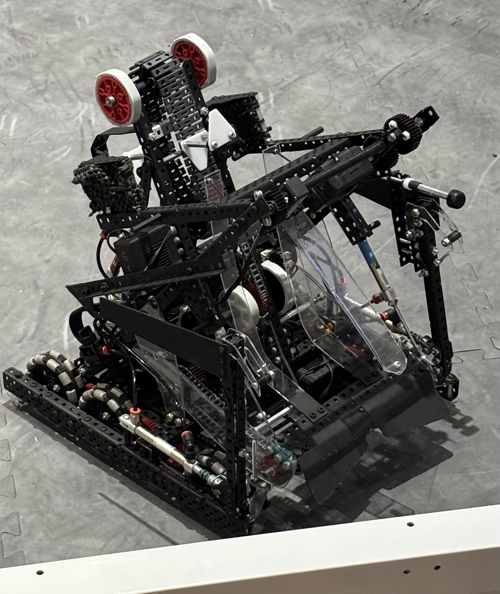

# Team 82855S Symphony Vex Robotics World Championship Code

This is our code for worlds, containing both TeleOp code and autonomous routes.



## Robot Stats
- Drivetrain: 6 motors, 450 rpm (36:48), six 3.25" omni wheels
- Intake: standard one motor intake
- Goal Clamp: Omni-directional clamp using two pneumatic cylinders
- Wall Stake Mechanism: 100 rpm
- Two Extending Arms: Plastic piece to sweep corner and mechanism to grab rings when rushing in autonomous
- Color Sort: Optical sensor on hooks sorts opposing teams rings
- Wall Stake PID: Rotational sensor on wall stake mechanism shaft ensures consistent loading and scoring angles
- Autonomous Sensing: One vertical 2" omni wheel odometry pod and an IMU

## Demo


## Setup
### NOTE 1: This code will not work on robots that are very different. Make sure your robot is compatible. (same type of drivetrain, intake, etc.)

### NOTE 2: The autonomous routes will require specific tuning for the particular robot

1. In Visual Studio Code, install the PROS extension
    - This will allow you to build and upload the code to a vex robot
2. Create a new PROS project using the extension
3. Clone this repository: ```git clone https://github.com/sharonbasovich/828555Sworlds```
4. Change config.h values to match particular robot
   - Especially, set the correct ports of each motor
## Routes:
- Ring Rush
   - Rushes to autonomous line with extending arm to grab rings quickly
   - Scores five rings on a mobile goal
- Solo AWP
    - Achieves autonomous win point (awp) without needing teammate to score anything
- Ladder Rings
    - Grabs rings from under the ladder using the extending arms
    - Scores four rings on mobile goal